1.VS code installation and set up:

First: Search the link to Open the VS code official webset: https://code.visualstudio.com/

Second: In the VS code webset, following the red arrow in the picture to click the download buttom

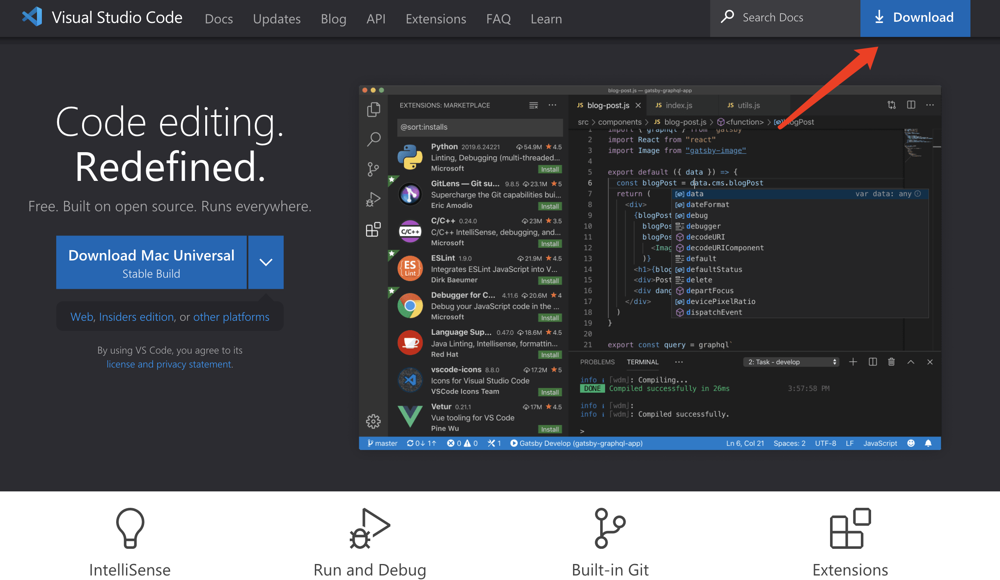

Third: In the download page, you can select a proper operating system.

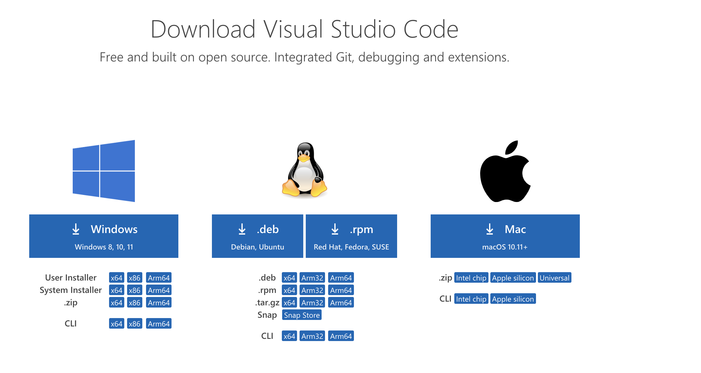

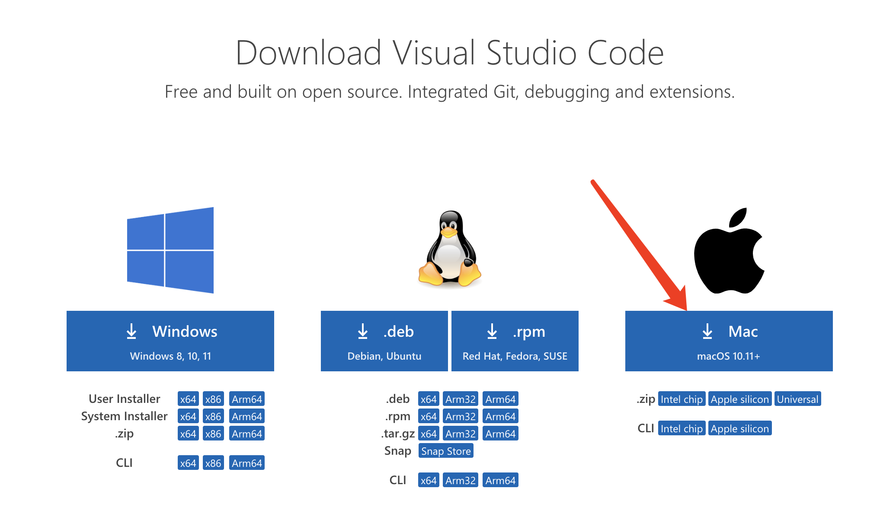

Fourth: For example, If you're a user with Mac, and then just follow the red arrow to down load the VS code for Mac operating system

Fifth: After the download finish, you could find the VS code following your download path. When you find it, open it and download it to local.

Sixth: after the download, open it and you will see the VS code main page. Click the Open folder or create a new file to begin your work!

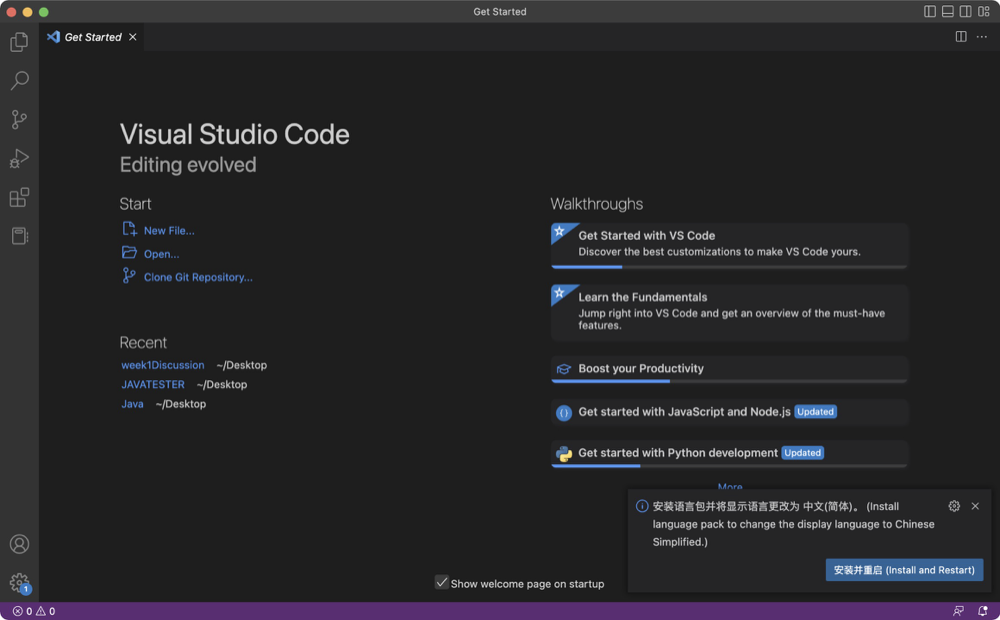

2.remote connection

Before the successful remote connection, it's important to prepare the ssh user name and password well.
The user name is already prepared when you entered the CSE15L. Now I will teach you how to find your 
user name and how to change the password to active your account.

(1) Look up your course-specific account for CSE15L here:
https://sdacs.ucsd.edu/~icc/index.php
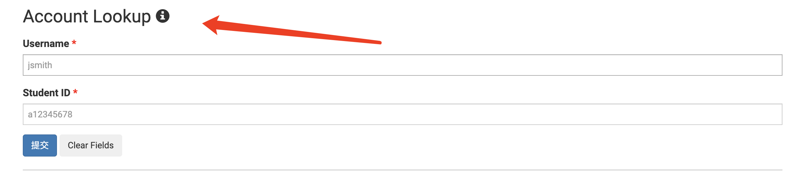

(2) After openning the link, you will see accounts loop up(as shown in the picture), please to type your user name and student ID correctly 
for searching your CSE15L username.

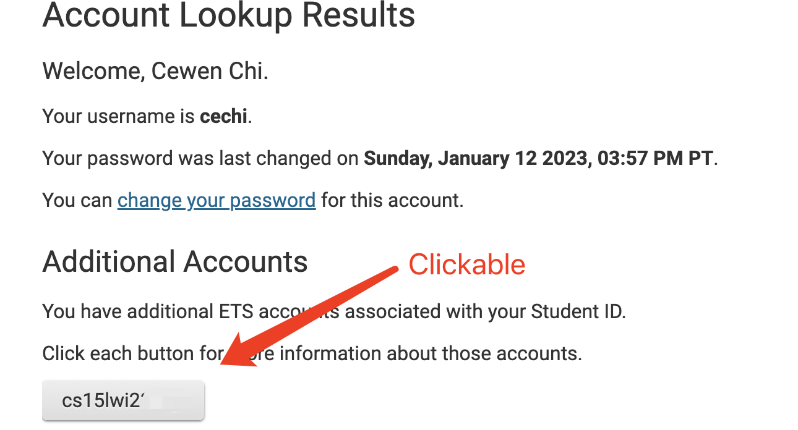

(3) After you successful log in, you will find out your cse15L username. And the username commonly starts with cse15l.

(4) Click the cse15l username, you can see 'change the passwork'(as picture), and you have to change the password now to active your account.

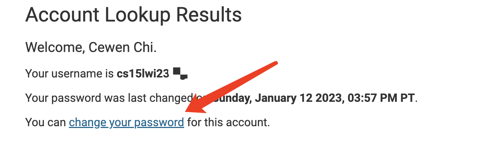

(5) After you changed your password, please wait for around 15 minuts. And then your username would work! lets use your valid account to learn how
to remote connect! 

Let's start to learn how to remote connect!

- First, type your user name:

When you trying to ssh by using the user name, remember to type 'ssh' following your user name for examaple ssh cs15lwi2ssss@ieng6.ucsd.edu

Several possibilities that could cause you fail to log in:

(1) add dollar sign before the ssh. It's going to show your command not found. Please retype ssh with your usernaame without dollar sign。

(2) type wrong passwords. If you type wrong passwords, you will see 'Password: ' again in a new line. It indicates you that you have to retype your 
correct password or username. It's highly recommoand to copy paste the password instead directly type.

- Second, type your correct password:
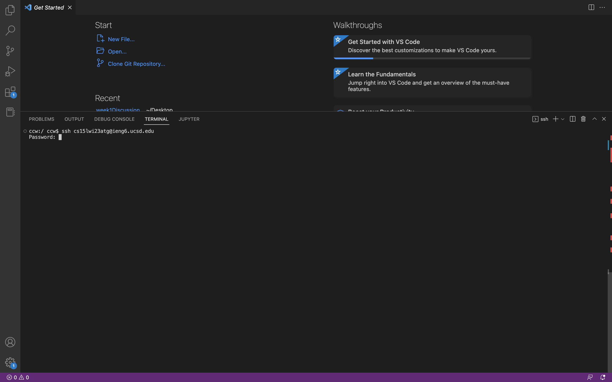

- Finally, after your successful typed your password, you will see:
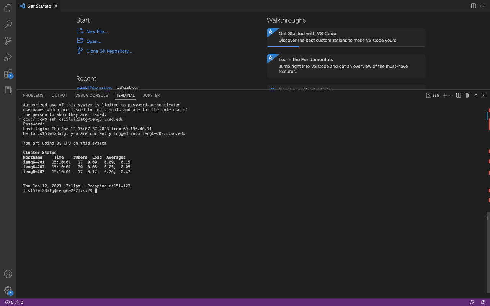

3.Try some useful commands:

ls -lat:
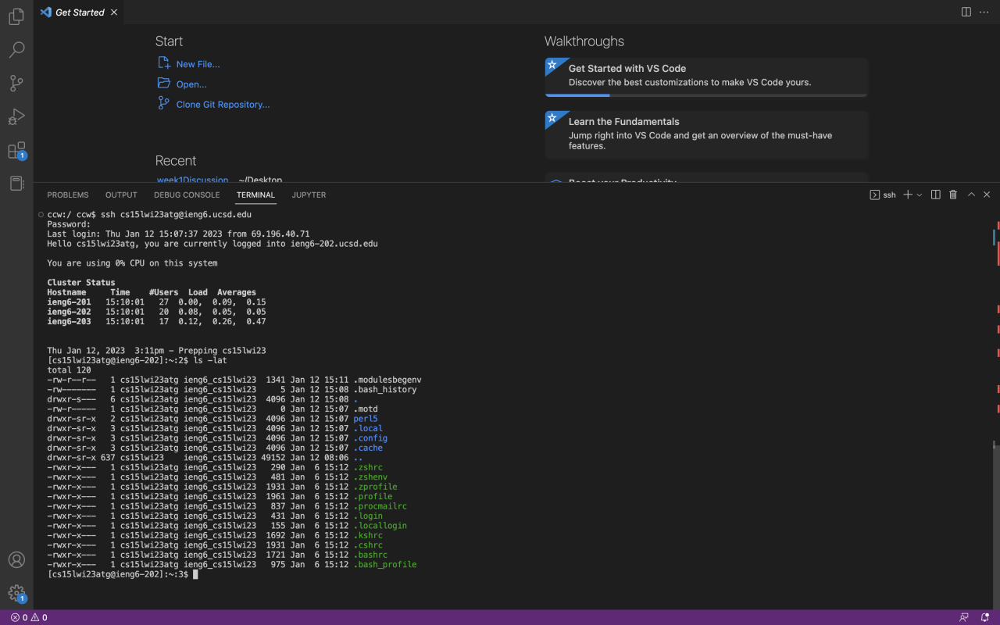
ls -a:
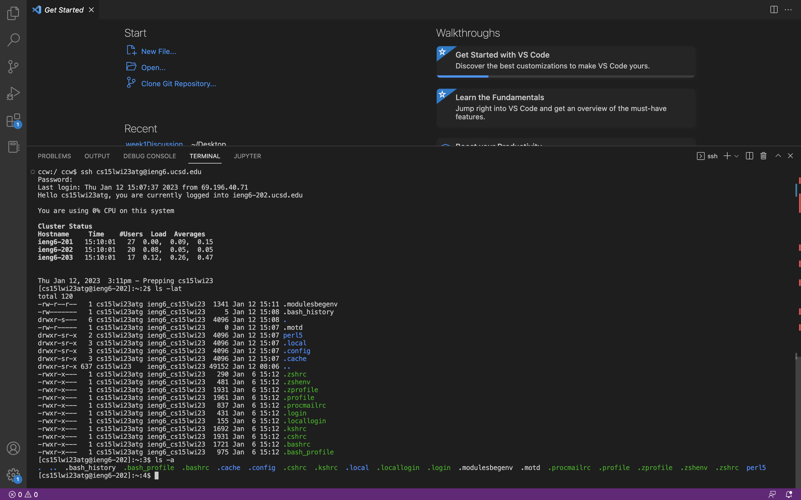
cat /home/linux/ieng6/cs15lwi23/public/hello.txt:
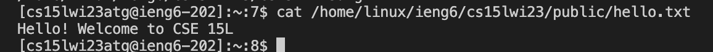
